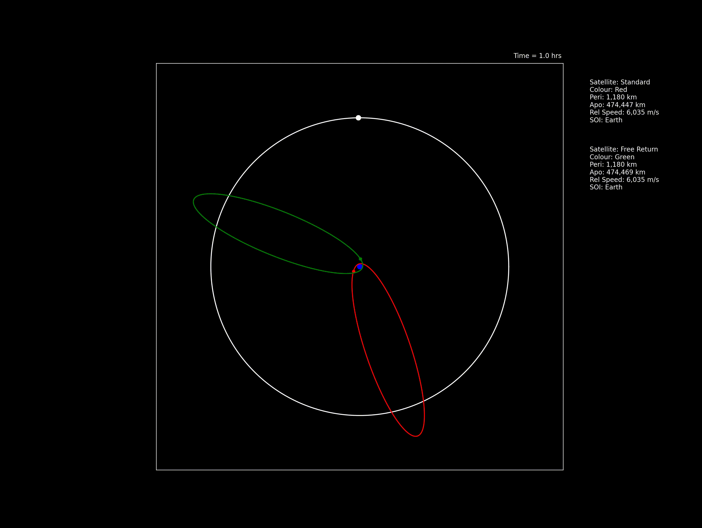
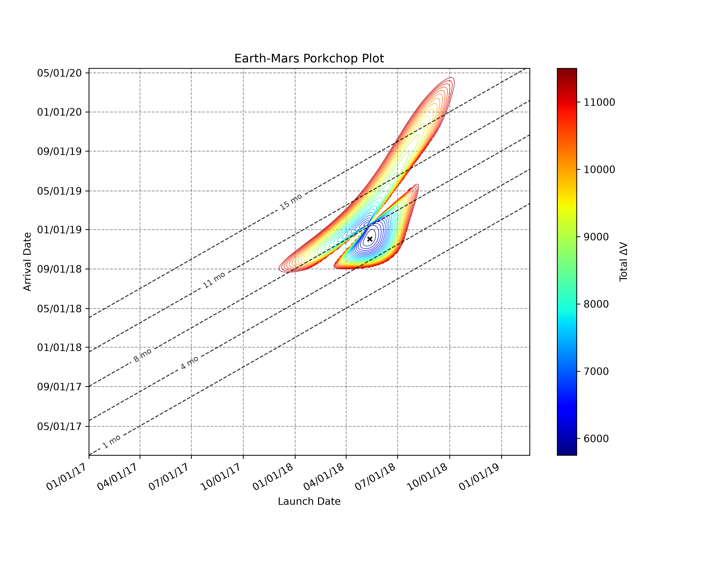

# Astrodynamics
Astrodynamics library containing various tools. Accessed with a CLI

## Features: 
- Gravitational Simulator
    - Runge-Kutta-Fehlberg Integrator
    - Execute maneuvers
    - Create both 2D and 3D animations
- Calculates Lagrange points 
- Lambert's Solver
- Porkchop Plot

## Example Outputs
This video demonstrates how a lunar flyby can be used to significantly speed up a spacecraft's return to Earth

Earth-Mars Porkchop Plot

